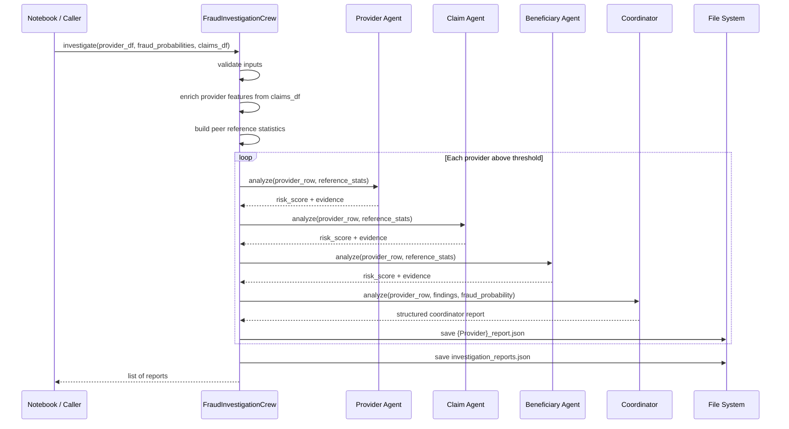

# Multi-Agent Investigation Workflow

## Architecture

The Multi-Agent module sits **after** the ML fraud prediction stage. It does not train models or modify features. Its role is to produce structured, explainable investigation reports for flagged providers.

```
┌─────────────────────────────────────────────────────────────┐
│                    ML Pipeline (unchanged)                   │
│  Data → Preprocessing → Feature Engineering → Ensemble ML   │
└─────────────────────────────┬───────────────────────────────┘
                              │ fraud_probability per Provider
                              ▼
┌─────────────────────────────────────────────────────────────┐
│              FraudInvestigationCrew.investigate()            │
│  ┌──────────────┐  ┌──────────────┐  ┌──────────────────┐  │
│  │ Threshold    │→ │ Claim        │→ │ Reference Stats  │  │
│  │ Filter       │  │ Enrichment   │  │ (peer group)     │  │
│  └──────────────┘  └──────────────┘  └──────────────────┘  │
│                              │                               │
│         ┌────────────────────┼────────────────────┐         │
│         ▼                    ▼                    ▼         │
│  Provider Agent      Claim Agent         Beneficiary Agent  │
│         └────────────────────┼────────────────────┘         │
│                              ▼                               │
│                   Investigation Coordinator                  │
│                              │                               │
│                              ▼                               │
│              JSON Reports (per provider + bundle)            │
└─────────────────────────────────────────────────────────────┘
                              │
              ┌───────────────┼───────────────┐
              ▼               ▼               ▼
        GenAI Explain    RAG Chatbot    Dashboard
```

---

## Sequence diagram



---

## Data flow

| Stage | Input | Output |
|-------|-------|--------|
| ML prediction | Feature matrix | `fraud_probability` per provider |
| Threshold filter | `fraud_probability`, `threshold` | Subset of flagged providers |
| Claim enrichment | `claims_df`, `provider_df` | Enriched provider metrics |
| Reference stats | Full provider population | Mean, std, percentiles, z-scores |
| Agent analysis | Provider row + peer stats | Per-agent risk score + evidence |
| Coordination | All agent outputs + ML probability | Final investigation report |
| Export | Report dict | JSON files in `outputs/` |

---

## Agent responsibilities

### Provider Analysis Agent

**File:** `agents/provider_analysis_agent.py`

Evaluates provider-level billing and utilization:

- Total and average reimbursement
- Claim volume and growth
- Inpatient/outpatient mix
- Patient and physician diversity
- Same attending/operating physician rate
- Deceased patient rate

Compares each metric against dynamic peer thresholds and returns a risk score with structured evidence.

### Claim Analysis Agent

**File:** `agents/claim_analysis_agent.py`

Detects claim-level billing anomalies:

- Duplicate claims ratio
- Repeated top diagnosis/procedure codes
- Claim duration and hospital stay intensity
- Maximum reimbursement outliers
- Single-day claim frequency spikes

### Beneficiary Analysis Agent

**File:** `agents/beneficiary_analysis_agent.py`

Assesses patient population patterns:

- Repeat visit ratio
- Beneficiary concentration (top 5% patient share)
- Chronic patient ratio
- Shared diagnosis clusters
- Provider dependency (patient loyalty to provider)
- Age and chronic condition burden

### Investigation Coordinator

**File:** `agents/coordinator_agent.py`

Aggregates all specialist findings:

- Extracts per-agent risk scores
- Merges evidence lists
- Blends specialist average (70%) with ML fraud probability (30%)
- Assigns priority tier and recommended actions
- Computes confidence from evidence count and ML probability

---

## Dynamic statistical analysis

All agents use **dataset-derived thresholds**, not hardcoded cutoffs. Reference statistics are computed from the current provider population via `utils/investigation_utils.py`.

A metric is flagged when **any** of these conditions hold:

| Direction | Trigger conditions |
|-----------|-------------------|
| High-risk | Percentile ≥ 95th **or** z-score ≥ 2 **or** value ≥ mean + 2×std |
| Low-risk | Percentile ≤ 5th **or** z-score ≤ −2 **or** value ≤ 5th percentile |

When peer standard deviation is zero, mean-based thresholds are skipped to avoid false positives.

---

## Risk aggregation

The coordinator computes:

```
specialist_avg = (provider_risk + claim_risk + beneficiary_risk) / 3
Fraud Score = min(1.0, specialist_avg × 0.7 + fraud_probability × 0.3)
```

Priority assignment:

| Fraud Score | Priority |
|-------------|----------|
| ≥ 0.8 | High |
| ≥ 0.6 | Medium |
| < 0.6 | Low |

Confidence:

```
Confidence = min(0.99, 0.5 + 0.05 × evidence_count + 0.2 × fraud_probability)
```

---

## Module layout

```
agents/
  provider_analysis_agent.py   # Provider billing analysis
  claim_analysis_agent.py      # Claim pattern detection
  beneficiary_analysis_agent.py # Patient utilization analysis
  coordinator_agent.py         # Report aggregation

crews/
  fraud_investigation_crew.py  # Orchestration and enrichment

tasks/
  investigation_tasks.py       # CrewAI task definitions (LLM path)

utils/
  investigation_utils.py       # Stats, validation, I/O helpers

scripts/
  run_investigation_test.py    # Multi-provider smoke test
  run_single_provider_test.py  # Single-provider reference test
```

---

## CrewAI integration (optional)

`FraudInvestigationCrew.run_crew()` executes the same logical workflow through CrewAI sequential tasks. This path requires `crewai` and a `GOOGLE_API_KEY` for Gemini. The default `investigate()` path uses deterministic Python analysis and is the recommended production entry point until the GenAI layer is added.

Task execution order:

```
Provider Task → Claim Task → Beneficiary Task → Coordinator Task
```

Each downstream task receives prior task outputs via CrewAI context chaining.

---

## Notebook integration

The final cell in `medical-provider-fraud-detection-system.ipynb` runs after ML prediction:

```python
from crews.fraud_investigation_crew import FraudInvestigationCrew
from utils.investigation_utils import create_probability_frame

claims_context = globals().get("claims_bene")
crew = FraudInvestigationCrew(output_dir="outputs", claims_df=claims_context)
investigation_reports = crew.investigate(
    provider_df,
    provider_probabilities,
    threshold=0.6,
    claims_df=claims_context,
)
```

Prerequisites in notebook namespace: `provider_df`, `y_proba`, `X_test`, `final_df`, and optionally `claims_bene`.
